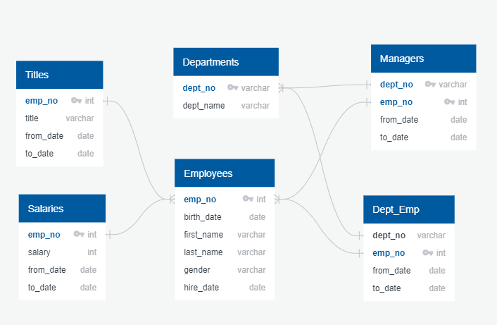
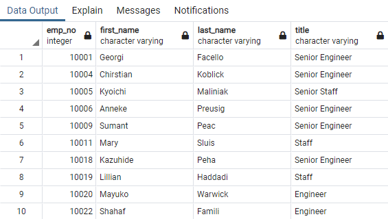
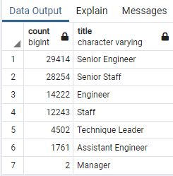
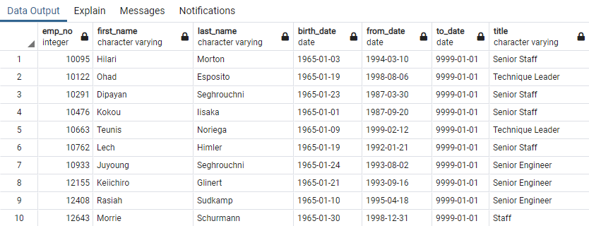
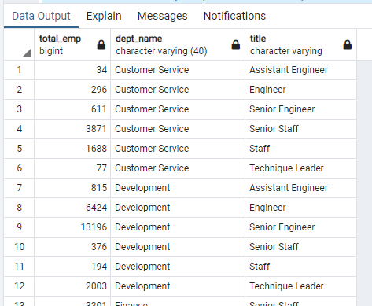
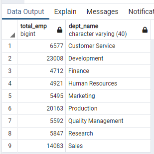

# Pewlett_Hackard_Analysis

## Overview of the Analysis

This project is the seventh weekly challenge of the Data Science Bootcamp. It allows us to put into practice and showcare the skills learned in Module 7 of the bootcamp.

### Purpose

Additional information and analysis has been requested on the employees eligible for retirement and mentorship in the company Pewlett Hackard.

The additional information requested is:

- list of employees eligible for retirement with all the titles they have held,
- list of employees eligible for retirement with their latest title,
- the number of retiring employees by title, and
- the list of employees eligible for the mentorship program.

## Results

Analysis of the provided data was carried out using pgAdmin 4 on a PostgreSQL database.

The database PH-EmployeeDB was created using the EDR below. The SQL code is summarized in the file [schema.sql](/Data/schema.sql).

[](EDR.png)

The input files for each input table were provided in CSV format and can be downloaded from the folder [Data/](Data/).

The SQL code used to produce the deliverables can be found in [Employee_Database_challenge.sql](Employee_Database_challenge.sql).

### Deliverable 1

This deliverable had 3 parts:

1. Using the EDR, we initially produced the table *retirement_titles* that held information for employees born between 1952 and 1955.  This table information for all the titles those employees have held during their time in Pewlett Hackard.  This table was exported as CSV file [retirement_titles.csv](Queries/retirement_titles.csv).
    
    A sample of the data in *retirement_titles* is below, as it can be seen some employees appear multiple times.
    
    The code used to generate the desired table is:

```SQL
SELECT 	e.emp_no, 
		e.first_name, e.last_name,
		t.title,
		t.from_date, t.to_date
INTO retirement_titles
FROM employees AS e
	LEFT JOIN titles AS t 
	ON e.emp_no = t.emp_no
WHERE (e.birth_date BETWEEN '1952-01-01' AND '1955-12-31')
ORDER BY emp_no;
```

|emp_no|first_name|last_name|title|from_date|to_date|
|:----:| ---| --- | ---|---|---|
|10001|Georgi|Facello|Senior Engineer|1986-06-26|9999-01-01|
|10004|Chirstian|Koblick|Engineer|1986-12-01|1995-12-01|
|10004|Chirstian|Koblick|Senior Engineer|1995-12-01|9999-01-01|
|10005|Kyoichi|Maliniak|Senior Staff|1996-09-12|9999-01-01|
|10005|Kyoichi|Maliniak|Staff|1989-09-12|1996-09-12|
|10006|Anneke|Preusig|Senior Engineer|1990-08-05|9999-01-01|
|10009|Sumant|Peac|Assistant Engineer|1985-02-18|1990-02-18|
|10009|Sumant|Peac|Engineer|1990-02-18|1995-02-18|
|10009|Sumant|Peac|Senior Engineer|1995-02-18|9999-01-01|
|10011|Mary|Sluis|Staff|1990-01-22|1996-11-09|

**NOTE:** This query as requested by the challenge includes employees that may no longer be employed by the company, an additional condition is required to filter by the *to_date* value.  This additional condition is included in Deliverable 2.

2. The second part of the deliverable involved removing the duplicates from the previous step and storing the result into the table *unique_titles* and exportin the results to the file [unique_titles.csv](Queries/unique_titles.csv). As it can be seen in the code below, this was accomplished by using the ```DISTINCT ON``` statement and include the *to_date* column into the ordering of the previous table *retirement_titles*.

```SQL
SELECT DISTINCT ON (emp_no) 
	emp_no, 
	first_name, last_name,
	title
INTO unique_titles
FROM retirement_titles
ORDER BY emp_no, to_date DESC;
```


3. The last part of this deliverable required to tally the number of employees in the previous list by *title* into the table *retiring_titles* and exporting this result to the file [retiring_titles.csv](Queries/retiring_titles.csv).

```SQL
SELECT count(*), title
INTO retiring_titles
FROM unique_titles
GROUP BY title
ORDER BY count(*) DESC;
```


### Deliverable 2

This deliverable required to create a mentorship eligibility table that holds the current employees who were born in 1965.

1. There are multiple ways to generate the desired table by merging the *employees*, *sept_emp* and *titles* tables. I used the approach below and used the ```DISTINCT ON``` functionality to obtain the latest title for each employee from the *titles* table.
2. The query stored the data in table *mentorship_eligibility*.  This table was then exported to the file [mentorship_eligibility.csv](Queries/mentorship_eligibility.csv).

```SQL
SELECT	e.emp_no,
		e.first_name, e.last_name,
		e.birth_date,
		de.from_date, de.to_date,
		t.title
INTO mentorship_eligibility
FROM employees AS e
LEFT JOIN dept_emp AS de
	ON e.emp_no = de.emp_no
LEFT JOIN   -- latest title for each employee
	(SELECT DISTINCT ON (emp_no) 
	 	emp_no, title
	 FROM titles
	 ORDER BY emp_no, to_date DESC) AS t
	ON e.emp_no = t.emp_no 
WHERE (e.birth_date BETWEEN '1965-01-01' AND '1965-12-31')
	AND (de.to_date = '9999-01-01')		-- current employees
ORDER BY e.emp_no;
```


## Summary

It stands out the large number of positions that would be affected by the wave of possible retirements. There are 90,398 employees that met the requirements outlined (DOB between 1952-1955).  They cover all 7 different titles and across all department in Pewlett Hackard. 

**NOTE:** the total drops to 72,458 when filtering for current employees.

The mentorship eligibility criteria (DOB in 1965) highlights 1,549 younger employees to be mentored by the older employees.  This number provides a manageable ratio of possible mentors to mentees.

However, given that there are over 50,000 employees in either Senior Engineer or Senior Staff.  It would be benefitial to increase the number of employees to be mentored and listed to take over those responsabilities within the next few year.

It is recommended to spand the criteria for mentorship eligibility.

It would be benefitial for the leadership team to have the retirement eligibility listed by departments.  This can be done by adding the department name information to the previous tables.

```SQL
SELECT 	e.emp_no, 
		e.first_name, e.last_name,
		dep.dept_name, t.title,
		t.from_date, t.to_date
INTO silver_tsunami
FROM employees AS e
	LEFT JOIN -- get latest title for each employee
		(SELECT DISTINCT ON (emp_no) 
		 	emp_no, title, from_date, to_date
		 FROM titles 
		 ORDER BY emp_no, to_date DESC ) AS t 
	ON e.emp_no = t.emp_no
	LEFT JOIN	-- get the latest dept_name for each emp_no by joining dept_emp and departments tables.
		(SELECT DISTINCT ON (de.emp_no)
			de.emp_no, de.dept_no, d.dept_name
			FROM dept_emp AS de LEFT JOIN departments AS d
		 		ON de.dept_no = d.dept_no
		 ORDER BY de.emp_no, de.to_date DESC) AS dep
	ON e.emp_no = dep.emp_no
WHERE (e.birth_date BETWEEN '1952-01-01' AND '1955-12-31')
ORDER BY emp_no;

-- Now group by department and title
SELECT Count(emp_no) AS total_emp, dept_name, title
FROM silver_tsunami
GROUP BY dept_name, title
ORDER BY dept_name, title;
```

The out produced looks like this:



The results can be totalled in a matrix as follow:


|Department|Assistant Engineer|Engineer|Senior Engineer|Senior Staff|Staff|Technique Leader|Manager|
|:----| ---:| ---: | ---:|---:|---:|---:|---:|
|Customer Services|34|296|611|3,871|1,688|77||
|Development|815|6,424|13,196|376|194|2,003||
|Finance||||3,301|1,411||
|Human Resources||||3,398|1,523||
|Marketing||||3,814|1,681||
|Production|675|5,540|11,549|437|154|1,808||
|Quality Management|205|1,586|3,299|||502||
|Research|32|376|759|3,216|1,351|112|1|
|Sales||||9,842|4,240||1|

The totals by department can be obtained using

```SQL
SELECT Count(emp_no) AS total_emp, dept_name
FROM silver_tsunami
GROUP BY dept_name
ORDER BY dept_name;
```
With the output as shown in the snapshot below.

